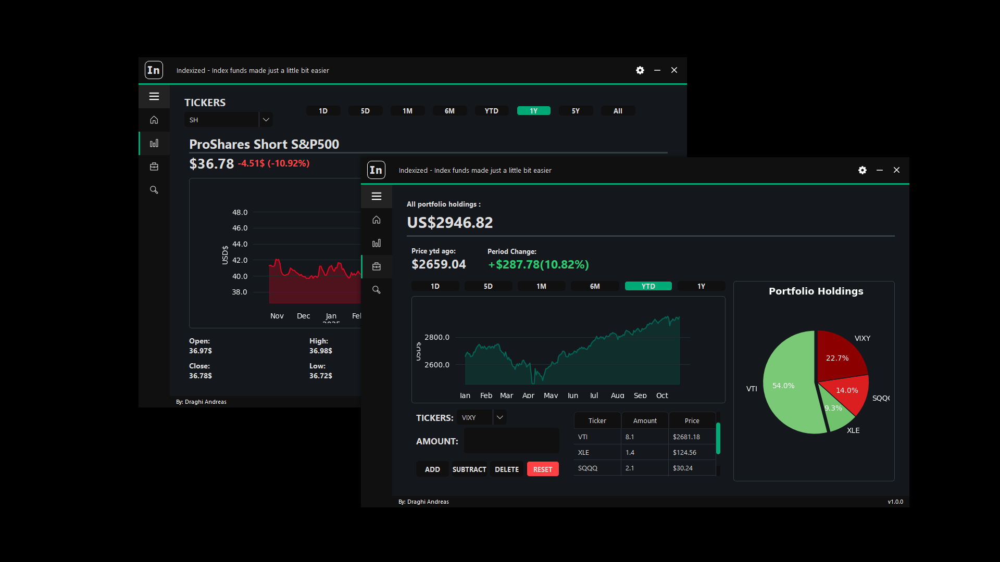

<p align="center">
  
</p>


<h1 align="center">Indexized</h1>

<p align="center">
  <em>A sleek, data-driven stock tracking desktop app built with Python.</em>
</p>

<p align="center">
  
  
  
  
  
</p>

---

## Preview

<p align="center">
  
</p>

---

## Overview

**Indexized** is a **modern desktop stock tracking and portfolio management app**, designed to make financial insights simple, visual, and interactive.  
It combines the power of **Yahoo Finance**, **PySide6 UI**, **SQLite storage**, and **Matplotlib** visualization — all wrapped in a clean interface.

---

## Features

### **Home Tab**
Your dashboard for quick insights:
- Personalized greeting: `"Welcome, <user>!"`
- Random inspirational quote fetched dynamically.
- Three sub-tabs for market summaries:
  - **Top Gainers:** Displays the 5 best-performing stocks.
  - **Top Losers:** Shows the 5 weakest stocks.
  - **Currencies:** Lists top 5 most important global currency exchange rates.

---

### **Stock Tracker**
Visualize and explore any stock:
- Select a **ticker** to track.
- View **historical evolution** and **live data**.
- Choose timeframes like `1d`, `5d`, `1mo`, `3mo`, `6mo`, `1y`, etc.
- Interactive **matplotlib charts** show price trends and movements.
- Additional company and market metrics for deeper insight.

---

### **Portfolio Manager**
Manage your personalized investment portfolio:
- Add or remove assets easily.
- Track asset quantities and total portfolio value.
- Four main controls:
  - **Add:** Add a specified amount of the selected ticker.
  - **Subtract:** Remove a specified amount.
  - **Delete:** Remove a ticker entirely.
  - **Reset:** Clear the portfolio with one click.
- All data is securely stored in an **SQLite** database for persistence.

---

### **Asset Library**
Explore all supported assets, neatly categorized:
- Browse **whitelisted tickers** grouped by sector or category.

---

## Tech Stack

| Component | Description |
|------------|-------------|
| **Python** | Core programming language |
| **PySide6** | GUI framework (Qt for Python) |
| **yfinance** | Fetches real-time and historical stock/currency data |
| **SQLite** | Local database for portfolio storage |
| **Matplotlib** | Plots and visualizes stock data |

---

## Installation

### 1. Clone the repository
```bash
git clone https://github.com/DraghiAndreas/Indexized.git
cd Indexized
```
### 2. Install the requirements
```bash
pip install -r requirements
```
### 3. Run main.py
```bash
python main.py
```
## License & About
### MIT License
### About:
Indexized was created as a personal project and a showcase of my skills as a student in Automation and Systems Engineering. The app demonstrates my ability to combine Python, PySide6, yfinance, SQLite, and Matplotlib into a functional, modern desktop application for stock tracking and portfolio management.

The user interface of Indexized is based on an open-source UI by Wanderson M. Pimenta. I have made significant changes and improvements to suit this project, but I want to give credit where it’s due.

This project serves as a learning and experimentation tool, helping me refine my software development skills while creating something both functional and visually appealing.